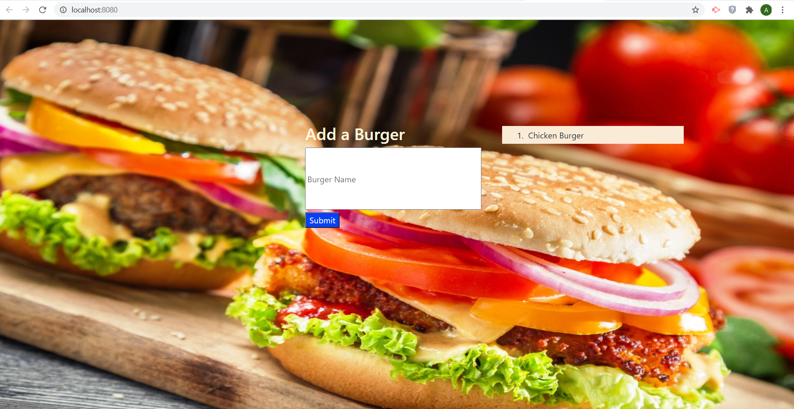

# Burgers-Handlebars
## Description
An application that allow user to add a burger name to a list and then the option to move it to devored list
## Technologies used
* [MySQL](#MySQL)
* [NODEJS](#NODEJS)
* [JAVASCRIPT](#JAVASCRIPT)
* [EXPRESS](#EXPRESS)
* [EXPRESS-HANDLEBARS](#[EXPRESS-HANDLEBARS)
## Installation
npm intall
## Usage
npm start
## badges
 
#### Heroku URL
https://burgers-handlebar.herokuapp.com/

#### URL Github Repo:
 https://aminbouzouita.github.io/Burgers-Handlebars/

#### Screenshot

---
© 2020 Amin Bouzouita.